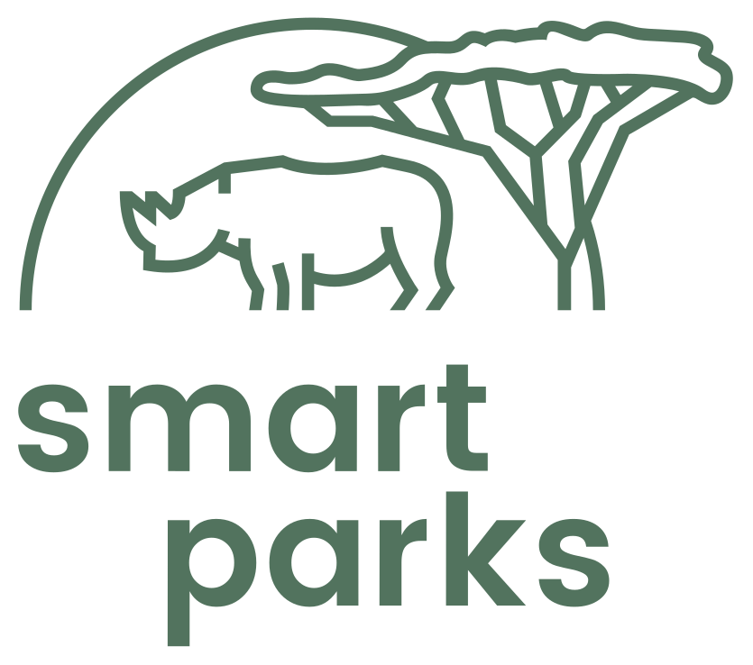

<p align="center">
  
</p>

# Smart Parks Protect

Self-hosted operational data platform for [Smart Parks](https://www.smartparks.org) deployments. It connects field devices and IoT platforms to one Smart Parks domain and makes that data useful: a live map, analysis and export, a rules engine that turns observations into events and alerts, device control, and durable integrations with systems such as EarthRanger.

**Status: pre-alpha.** The repository foundation exists (services, compose stack, CI, docs). Nothing user-facing runs yet. The roadmap is in [`PROJECT_PLAN.md`](PROJECT_PLAN.md); the first release, v0.1.0, is a simulated OpenCollar moving on the map.

## Core concepts

- **Devices are hardware, entities are what you care about.** An animal, vehicle, gate or weather station is an entity. A collar or sensor is a device. Time-bounded assignments link them, so hardware can be replaced without losing history.
- **Connectivity adapters** talk to external platforms (ChirpStack, KPN, LORIOT, Traccar, Cloudloop) and know nothing about devices.
- **Device drivers** decode device protocols and encode commands (OpenCollar first) and know nothing about networks.
- **Raw data is kept.** Every inbound message is stored as an immutable source event. Decoded and normalized data (positions, measurements, states, events) link back to it.
- **Canonical time is device time.** Records are attributed to the project and entity that owned the device when the record was generated, not when it arrived.
- **Every record has a trace.** A processing trace explains where a message, command, import or delivery went and where it stopped.
- **Queries are bounded.** Every map, chart, table and export endpoint has a viewport, time range, page or resolution limit.
- **Rules produce meaning.** Versioned, testable rules create events; automations act on them; alerts are events that need a person.
- **Control is bidirectional.** Commands go through one capability-driven path whether a person or an automation issues them.
- **Integrations are first class.** Outbound delivery is durable, retried and inspectable.

## Documentation

- [`Smart_Parks_Protect_Concept_Architecture.md`](Smart_Parks_Protect_Concept_Architecture.md): the concept architecture (draft v16), the source for everything here.
- [`PROJECT_PLAN.md`](PROJECT_PLAN.md): phases, decisions, definition of done, session log.
- [`DEVELOPERS.md`](DEVELOPERS.md): how the code works today.
- [`CONVENTIONS.md`](CONVENTIONS.md) and [`CONTRIBUTING.md`](CONTRIBUTING.md): how we work.
- `docs/`: the documentation site (`scripts/dev.sh docs` builds it).

## Running the foundation

```bash
cp .env.example .env
docker compose up -d
```

API documentation at <http://localhost:8000/api/docs>, health at <http://localhost:8000/api/health>, placeholder frontend at <http://localhost:3000>. A full quick start with a simulated collar arrives with v0.1.0.

## Relationship to AddaxAI Connect

[AddaxAI Connect](https://github.com/PetervanLunteren/AddaxAI-Connect) is the camera trap platform this project learns from. Smart Parks Protect is written from scratch and reuses patterns, not code; the [reuse audit](docs/architecture/addaxai-connect-reuse-audit.md) records what was taken. AddaxAI Connect detections will enter Smart Parks Protect as events through a standard inbound connector.

## Licence

MIT, see [`LICENSE`](LICENSE).
