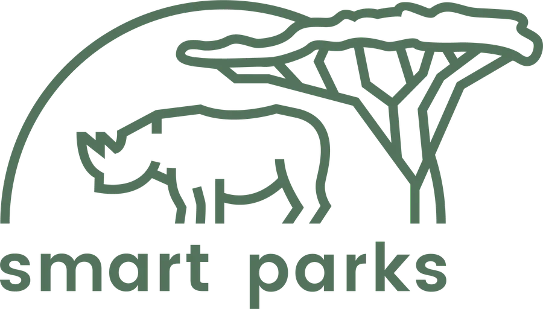

<p align="center">
  
</p>

# Smart Parks Protect

Self-hosted operational data platform for [Smart Parks](https://www.smartparks.org) deployments. It connects field devices and IoT platforms to one Smart Parks domain and makes that data useful: a live map, analysis and export, a rules engine that turns observations into events and alerts, device control, and durable integrations with systems such as EarthRanger.

**Status: v2.5.0 released on 2026-09-09**, with connectivity and network locations, the live map's controls and its feed, the entity type catalogue and the health dot live on the development server since, ahead of v2.6.0; see `CHANGELOG.md`.

## Core concepts

- **Devices are hardware, entities are what you care about.** An animal, vehicle, gate or weather station is an entity. A collar or sensor is a device. Time-bounded assignments link them, so hardware can be replaced without losing history.
- **Connectivity adapters** talk to external platforms (ChirpStack, KPN, LORIOT, Traccar, Cloudloop) and know nothing about devices.
- **Device drivers** decode device protocols and encode commands (OpenCollar first) and know nothing about networks.
- **Raw data is kept.** Every inbound message is stored as an immutable source event. Decoded and normalized data (positions, measurements, states, events) link back to it.
- **Canonical time is device time.** Records are attributed to the project and entity that owned the device when the record was generated, not when it arrived.
- **Every record has a trace.** A processing trace explains where a message, command, import or delivery went and where it stopped.
- **Queries are bounded.** Every map, chart, table and export endpoint has a viewport, time range, page or resolution limit.
- **Rules produce meaning.** Versioned, testable rules create events; automations act on them; alerts are events that need a person.
- **Control is bidirectional.** Commands go through one capability-driven path whether a person or an automation issues them.
- **Integrations are first class.** Outbound delivery is durable, retried and inspectable.
- **Devices on the map beside their entities.** A device layer, off by default, shows collars with or without an animal and a device's own track across the entities it tracked.
- **All projects at once for server admins.** The live map, the lists and the network pages over every project, read-only, with devices in no project visible until assigned.
- **Bulk onboarding and assignment.** Unknown identities become devices in one go, and a selection of devices joins a project from its first data, with an entity each if wanted.
- **ChirpStack onboarding from the tenant.** One tenant API key connects every application of a ChirpStack to the platform's webhook, over native gRPC or grpc-web, application by application and undoable.
- **Simple first.** Every page shows the operational picture; the machinery sits one click deeper on the Data, Connectivity and Network tabs of an entity or device.
- **Entity types with sub-types.** Every server starts with the standard catalogue (wildlife, people, vehicles, infrastructure, environmental sensors, equipment and about 240 sub-types with their icons); a project hides what it does not need. The icons are the EarthRanger set, Apache 2.0, vendored with their licence.
- **The live map is a tool.** Draw a point, line, polygon or circle into a feature, measure with a running length or area, follow your own position, switch base maps and terrain, and see the network's gateways, coverage and locations as layers.
- **A feed on the map.** Alerts and events of the project under the Layers button, unread per person, a toast when an alert fires while the map is open.
- **Network health apart from device health.** Every device has a Connectivity tab per data source, the Gateways page lists a project's whole network with what hears and what is silent, and the gateway list is synced from the platforms daily.
- **A health dot on every page.** Green while every worker reports and no system alert is open, slow to turn amber, red only when the server stops answering.
- **Notifications by email and Telegram.** Automations send alerts to a mailbox or a chat; an SMTP server is optional configuration.

## Documentation

- [`Smart_Parks_Protect_Concept_Architecture.md`](Smart_Parks_Protect_Concept_Architecture.md): the original concept architecture (draft v16, August 2026) the work started from; the built system is described in `DEVELOPERS.md`, `PROJECT_PLAN.md` and the docs site.
- [`PROJECT_PLAN.md`](PROJECT_PLAN.md): phases, decisions, definition of done, session log.
- [`DEVELOPERS.md`](DEVELOPERS.md): how the code works today.
- [`CONVENTIONS.md`](CONVENTIONS.md) and [`CONTRIBUTING.md`](CONTRIBUTING.md): how we work.
- `docs/`: the documentation site (`scripts/dev.sh docs` builds it).

## Quick start

Requirements: Docker with Compose v2. For development also [uv](https://docs.astral.sh/uv/) and Node 24.

```bash
git clone https://github.com/SmartParksOrg/smartparks-protect.git
cd smartparks-protect
cp .env.example .env                                  # set the secrets before any server use
docker compose --profile chirpstack up -d             # database, redis, minio, api, workers, frontend, local ChirpStack
scripts/dev.sh bootstrap-admin you@example.org        # prints the registration link for the first server admin
```

Open the link, create your account, sign in at <http://localhost:3000>. Then let the bootstrap set up the local ChirpStack (tenant, application, device profile, gateway, device) and the demo project in Protect (project, OpenCollar device type, device `SP05-sim` with its DevEUI, entity `Rhino 14`):

```bash
scripts/dev.sh chirpstack-bootstrap --demo --protect-email you@example.org --protect-password '...'
scripts/dev.sh simulate --application-id <id printed by the bootstrap> --count 20 --rate 2
```

The simulator publishes OpenCollar uplinks the way ChirpStack does: a GNSS position per uplink and a status message every fifth. Open the live map of Demo park and watch the rhino move. Traffic, traces and health are under Network and Server admin. Without `--demo` you create the project, types, device and entity yourself under Server admin, or accept the unknown DevEUI from Needs attention.

Endpoints: API docs <http://localhost:8000/api/docs>, health <http://localhost:8000/api/health>, ChirpStack <http://localhost:8080> (admin / admin), MinIO console <http://localhost:9001>.

## Branding a server

The sign-in, registration and password pages sit on one of four Smart Parks landscapes, served unhashed from `services/frontend/public/auth-background-1.webp` to `-4.webp`, so a server can put its own pictures there and restart the frontend without a rebuild. The logos live in `services/frontend/src/assets/brand/`.

## Relationship to AddaxAI Connect

[AddaxAI Connect](https://github.com/PetervanLunteren/AddaxAI-Connect) is the camera trap platform this project learns from. Smart Parks Protect is written from scratch and reuses patterns, not code; the [reuse audit](docs/architecture/addaxai-connect-reuse-audit.md) records what was taken. AddaxAI Connect detections will enter Smart Parks Protect as events through a standard inbound connector.

## Licence

MIT, see [`LICENSE`](LICENSE).
